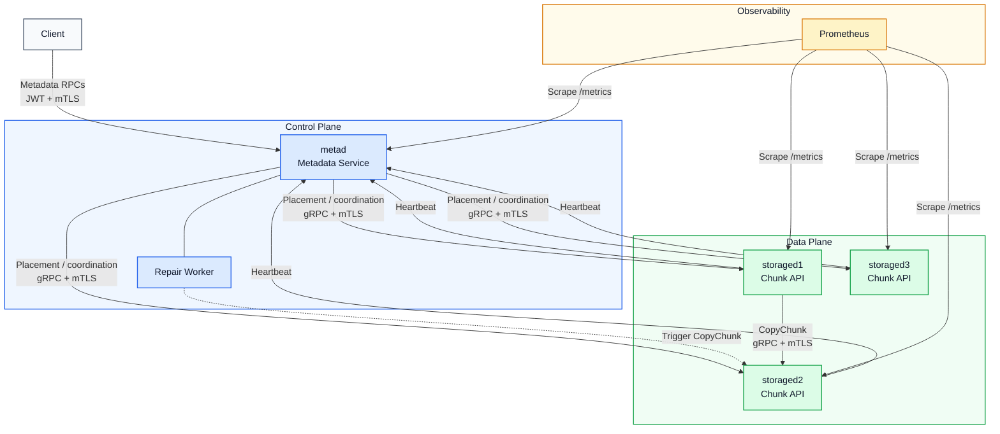

# 1024-dfs Architecture

```mermaid
flowchart TB
    client[Client]

    subgraph CP["Control Plane"]
        direction TB
        metad["metad<br/>Metadata Service"]
        repair["Repair Worker"]
        metad --- repair
    end

    subgraph DP["Data Plane"]
        direction LR
        s1["storaged1<br/>Chunk API"]
        s2["storaged2<br/>Chunk API"]
        s3["storaged3<br/>Chunk API"]
    end

    subgraph OBS["Observability"]
        direction TB
        prom["Prometheus"]
    end

    client -->|Metadata RPCs<br/>JWT + mTLS| metad

    metad -->|Placement / coordination<br/>gRPC + mTLS| s1
    metad -->|Placement / coordination<br/>gRPC + mTLS| s2
    metad -->|Placement / coordination<br/>gRPC + mTLS| s3

    s1 -->|Heartbeat| metad
    s2 -->|Heartbeat| metad
    s3 -->|Heartbeat| metad

    repair -.->|Trigger CopyChunk| s2
    s1 -->|CopyChunk<br/>gRPC + mTLS| s2

    prom -->|Scrape /metrics| metad
    prom -->|Scrape /metrics| s1
    prom -->|Scrape /metrics| s2
    prom -->|Scrape /metrics| s3

    classDef client fill:#F8FAFC,stroke:#475569,stroke-width:1.5px,color:#0F172A;
    classDef control fill:#DBEAFE,stroke:#2563EB,stroke-width:1.5px,color:#0F172A;
    classDef data fill:#DCFCE7,stroke:#16A34A,stroke-width:1.5px,color:#0F172A;
    classDef obs fill:#FEF3C7,stroke:#D97706,stroke-width:1.5px,color:#0F172A;

    class client client;
    class metad,repair control;
    class s1,s2,s3 data;
    class prom obs;

    style CP fill:#EFF6FF,stroke:#2563EB,stroke-width:1.5px,color:#0F172A
    style DP fill:#F0FDF4,stroke:#16A34A,stroke-width:1.5px,color:#0F172A
    style OBS fill:#FFFBEB,stroke:#D97706,stroke-width:1.5px,color:#0F172A
```
